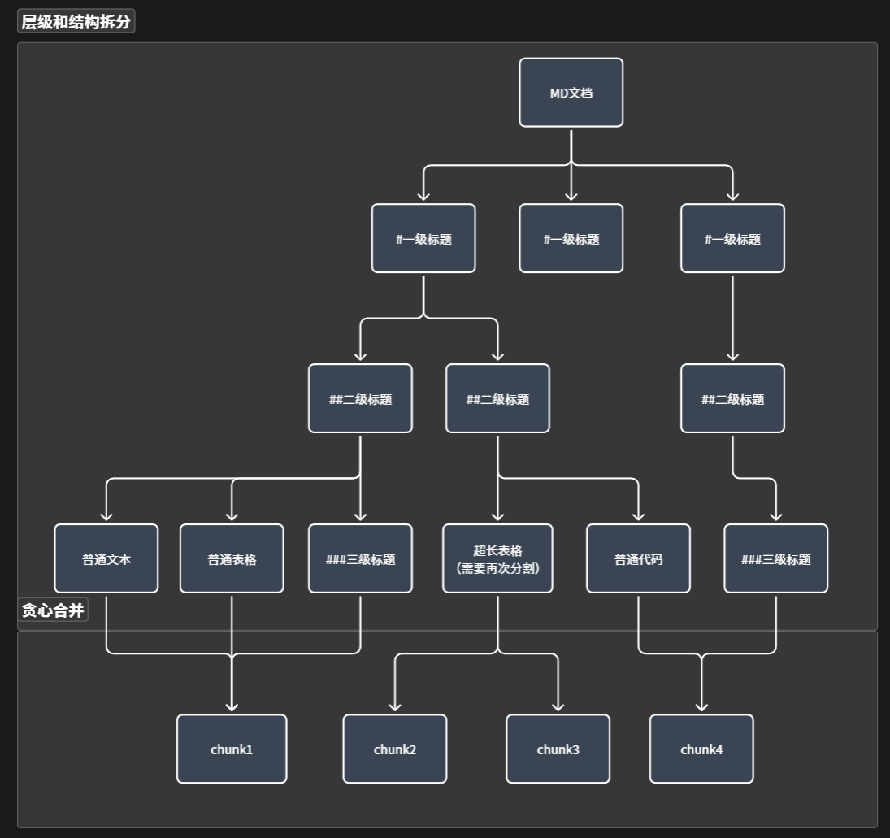

# 智能 Markdown 拆分器

这是一个专为 RAG (检索增强生成) 场景设计的智能 Markdown 文档拆分工具。它摒弃了传统简单粗暴的“按固定字符数物理切分”方式，而是深入解析 Markdown 的语法结构，在严格保证文档层级结构和上下文语义完整性的前提下，实现高效、精准的知识块切分。

## 核心架构与思想

本工具的核心架构将长文本 Markdown 的拆分过程解耦为**结构解析**、**元素分离**以及**贪心合并**三个阶段。旨在打破物理切分的局限，在保证 Token 空间利用率的同时，构建具备语义内聚的 RAG 知识块。



### 1. 基于 AST 的层级感知与结构拆分 (core.py)

Markdown 文件天然具备由 `#`, `##`, `###` 等标题定义的树形层级结构，每个层级下又包含文本、代码块、表格等异构元素。本阶段的核心是**自顶向下的递归降维**：

- **构建语义树**：尝试将整个文档作为一个完整的 Chunk。若其 Token 大小超过设定的 `max-tokens` 阈值，则按 H1 标题将文档拆分为多个子节点（Section）。

* **递归下钻**：若拆分后的某个 Section 节点依然大于 `max-tokens`，则继续利用 H2 标题进行次级拆分，依此类推，直到遍历完所有标题层级。
* **叶子节点解构**：若已下钻至最小标题层级，但该节点依然超限，则将其内部的原子元素（文本、表格、代码块）剥离出来。如果某个单一元素自身的大小仍然大于 `max-tokens`，此时**不进行切断**，而是将其打上标记，交由后续阶段动态处理。
* **上下文血缘**：在整个遍历建树的过程中，系统会始终维护当前节点的父级标题路径。无论子节点最终被切分到哪里，都将继承完整的上级标题元数据，确保检索时的全局上下文不丢失。

### 2. 特定元素智能分段与贪心合并 (segmenter.py & merger.py)

经过第一阶段，文档已被转化为一棵包含各类叶子节点（Section/Code/Table/Text）的树。接下来，系统将按文档原始顺序对这些叶子节点进行**贪心组装与动态拆分**。

- **贪心组装规则**：不断向当前 Chunk 中累加节点。如果 `已合并节点的 Token 数 + 当前节点 Token 数 <= max-tokens`，则安全合并；否则，结算当前 Chunk，开启新的部分。
- **超长元素的动态切分**：在合并过程中，若遇到之前被标记为超长的 Code/Table/Text 单一节点，系统将根据元素类型，调用专属拆分器进行拆分：
  - **Text 拆分器**：采用递归字符拆分逻辑，优先在自然段落、句号等语义边界处安全断句，并保留适度的重叠区域。
  - **Table 拆分器**：以“表格行”为最小粒度进行断句。强制在每个拆分后的表格片段头部重新拼接原始表头，保证每一行数据在独立检索时字段语义不丢失。
  - **Code 拆分器**：基于语法解析（借助 LangChain），根据具体的编程语言（如 Python, TSX）进行智能拆分，最大程度确保函数、类定义的逻辑完整性。
  - **元数据标记与检索增强**：当一个完整的语义单元 Code/Table/Text 被切分时，系统会在 Metadata 中自动注入结构化标记，以便于后续的检索召回与重组。关键字段包括：
    - `has_incomplete_structure`: 标记当前分块是否包含被切分的不完整结构。
    - `incomplete_structure_type`: 指明不完整结构的类型（如 `code`, `table`, `text`）。
    - `group_id`: 同一原始元素切分出的所有分块共享此 ID，用于通过 Group ID 召回完整内容。
    - `chunk_index` / `total_chunks`: 标识当前分块在整体切分序列中的位置。

### 3. 内容注入与语义增强 (Enrichment)

在获得组装完毕的 Chunk 后，系统会利用 Metadata 中的元素对原文本进行语义增强。将文档标题、层级路径等关键元数据以前缀的形式注入到切分后的 `page_content` 中，让大模型在阅读局部碎片时也能获悉全局语境。

***

## 元数据 (Metadata) 设计

由于一个完整的语义区块可能会被物理拆分，系统通过生成丰富且精确的 Metadata 字段来进行追踪和标记，这对后续的向量检索、硬过滤以及前端溯源至关重要。

### 核心字段说明

- `title`: 文档级标题，用于宏观检索和排序。
- `hierarchy`: 文档的层级结构（从根标题到当前子标题的完整路径数组）。
- `token_count`: 当前 Chunk 的精确 Token 数量。
- `complete_codes_count`: Chunk 内部包含的完整代码块数量，用于有关于代码的检索。
- `complete_tables_count`: Chunk 内部包含的完整表格数量，用于有关于表格的检索。
- `has_incomplete_structure`:  布尔值，标记当前 Chunk 是否包含被强行切断的不完整元素（如超长代码块或表格的某一部分）。
- `incomplete_structure_type`: 若上一个字段为 true，此字段指明不完整元素的类型（`code` / `table` / `text`）。
- `total_chunks`: 针对被切分的超长元素，标记其被拆分成了多少个 Chunk。
- `chunk_index`: 当前 Chunk 在该超长元素所属切片序列中的索引（从 1 开始）。
- `group_id`:  唯一标识符。所有属于同一个原始超长元素的 Chunk 共享此 ID，用于后续召回和还原该元素。
- `path`: 文档的相对/绝对路径，用于定位和溯源。

### 示例数据

**示例 A：完整且包含多层级的常规 Chunk**

```json
"metadata": {
    "title": "Taro.downloadFile(option)",
    "hierarchy": [
      "Taro.downloadFile(option)/参数/FileSuccessCallbackResult",
      "Taro.downloadFile(option)/示例代码"
    ],
    "token_count": 426,
    "complete_codes_count": 1,
    "complete_tables_count": 1,
    "has_incomplete_structure": false,
    "path": "docs/apis/network/download.md"
}

```

**示例 B：超长表格被切分后的第二个 Chunk**

```json
"metadata": {
    "title": "Taro.request(option)",
    "hierarchy": [
      "Taro.request(option)/参数/Option/table"
    ],
    "token_count": 459,
    "complete_codes_count": 0,
    "complete_tables_count": 0,
    "has_incomplete_structure": true,
    "incomplete_structure_type": "table",
    "total_chunks": 4,
    "chunk_index": 2,
    "group_id": "table_9ac3e017b94146029fac4e3a6d5dc31f",
    "path": "docs/apis/network/request.md"
}

```

***

## 环境配置与使用指南

本项目依赖 Python 3.8+ 环境运行。

### 1. 安装依赖库

请执行以下命令安装核心依赖：

```bash
pip install pyyaml tiktoken langchain langchain-text-splitters pydantic

```

### 2. 项目结构说明

- `core.py`: 核心逻辑入口，包含 `SmartMarkdownTreeSplitter` 类，负责整体的 AST 建树和递归拆分流程。
- `segmenter.py`: 包含 `BlockSplitter` 类，负责文本、代码、表格的底层逻辑切分。
- `schemas.py`: 定义 Pydantic 数据模型，如配置项 `SplitterConfig` 和用于流程间传递的统一 `Node` 结构。
- `config.yaml`: 全局配置文件，用于动态调整 Token 限制、重叠窗口大小及特殊处理规则。

### 3. 配置与运行

#### 3.1 配置文件 (`config.yaml`)

在运行前，可以通过修改 `config.yaml` 来精细调节切分策略：

```yaml
chunking_rules:
  max_tokens: 500          # 每个 Chunk 允许的最大 Token 数
  overlap_tokens: 50       # 纯文本 Chunk 之间的上下文重叠 Token 数
  encoding_name: "cl100k_base" # 计数的 Tokenizer 编码

element_processing:
  table_header_retention: true # 拆分长表格时自动注入表头
  enrich_enabled: true # 开启元数据注入与语义增强

```

#### 3.2 批量处理文档目录 (`test_docs_process.py`)

该脚本用于扫描指定目录下的所有 `.md` 文件，进行批量并行切分，并输出标准化结果。

- **运行命令**：

```bash
python test_docs_process.py

```

- **默认配置说明**：
- 输入路径：`test-docs/apis`, `test-docs/components`
- 输出路径：`output/` (结果将保存为 `.jsonl` 格式，文件名为 `chunk_<原文件名>.jsonl`)
- **输出结构**：生成的每一行代表一个 LangChain 的 `Document` 对象，包含经过语义增强的 `page_content` 以及 `metadata`。

#### 3.3 快速测试单文件 (`test_markdown_process.py`)

快速验证特定 Markdown 文件的切分表现。

- **运行命令**：

```bash
python test_markdown_process.py

```

- **说明**：默认读取 `test_doc.md`，执行完整的拆分与合并流程，并将可视化的结果输出至控制台或 `output/` 目录中。

